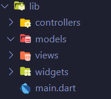

[](https://github.com/gadgetvala/flutter_bulk_UI/tree/main/food)
[](https://github.com/gadgetvala/flutter_bulk_UI/tree/main/food/issues)
[](https://www.linkedin.com/in/gadgetvala/)

# Introduction

> “Food”
is a small, simple and beautiful Flutter UI.

Before we start, you can take a look at the app:


## :bulb: Key Features

- [x] Beautiful UI and Transition.
- [x] Sort Based on Selection.
- [x] Grid View.

## 🚀 &nbsp;Installation

To clone and run this application, you'll need [Git](https://git-scm.com) and [Flutter](https://flutter.dev/docs/get-started/install) installed on your computer. From your command line:

```bash
# Clone this repository
$ git clone https://github.com/gadgetvala/flutter_bulk_UI.git

# Go into the repository
$ cd flutter_bulk_UI/food

# Install dependencies
$ flutter packages get

# Run the app
$ flutter run
```


### Packages


Some very good packages are used in the project, not a big list.
Below are the information about these packages.

package | explain
---|---
[google_nav_bar](https://pub.dev/packages/google_nav_bar) | Bottom Navigation

### Directory Structure

The project directory structure is as follows:

```
├── android
├── asset
├── build
├── images
├── ios
├── lib
├── pubspec.lock
├── pubspec.yaml

```


Let me explain the other directories besides **lib**:

directory | explain
---|---
images | readme images files
asset | images for android app

Then the lib directory




directory | explain
---|---
models | Schemas
screens | Presentation Layer
widgets | Smaller Widgets
main.dart | Main App Startup

## :clap: Done
Feel free to **file a new issue** with a respective title and description on the the [Flutter Bulk UI](https://github.com/gadgetvala/flutter_bulk_UI/issues) repository. If you already found a solution to your problem, **I would love to review your pull request**! 

## 📘&nbsp; License
The Flutter Bulk UI Repo is released under the under terms of the [MIT License](LICENSE).

## :heart: Contributor
Made by [Suraj Verma](https://github.com/gadgetvala)

